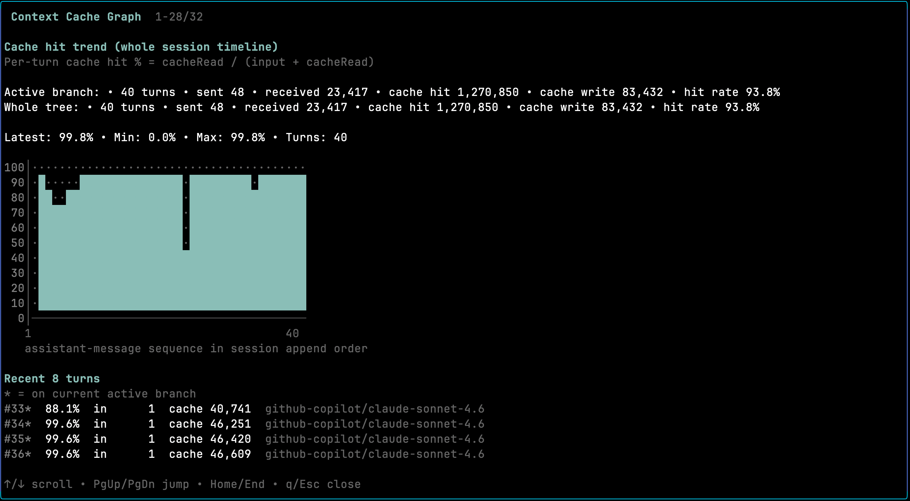

# pi-cache-graph

A project-local [pi](https://github.com/mariozechner/pi) extension that adds cache inspection commands for monitoring LLM context cache usage.

This extension was built primarily to add **observability to the [pi-context-prune](https://github.com/championswimmer/pi-context-prune) extension** — which compacts the session context to keep token usage down. `pi-cache-graph` lets you see in real time how effectively the cache is being used and how pruning affects cache hit rates over a session.



Adds cache inspection commands:

- `/cache graph` — shows cache hit % over time for assistant turns across the current session timeline
- `/cache stats` — shows per-message token/cache breakdown for assistant messages across the whole session tree, plus cumulative totals
- `/cache export` — writes the same stats data to `session-name.csv` at the project root

## Commands

### `/cache graph`
Opens a TUI overlay with **three switchable views**:

| Key | View | Description |
|-----|------|-------------|
| `1` | Per-turn (%) | Cache hit % per individual turn (default) |
| `2` | Cumulative (%) | Running cache hit % across all turns so far |
| `3` | Cumulative (total) | Running cumulative token volumes (input / cacheWrite / cacheRead) |

**Keyboard shortcuts inside the dialog:**
- `1` / `2` / `3` — jump directly to that view
- `v` — cycle view forward
- `V` (Shift+v) — cycle view backward
- `↑/↓`, `PgUp/PgDn`, `Home/End` — scroll
- `q` / `Esc` — close

All views show active-branch totals and whole-tree totals at the top.

Cache hit % is computed as:

```text
cacheRead / (input + cacheRead + cacheWrite)
```

The denominator is the full prompt size that was sent in the turn:
- `input` — fresh, non-cached prompt tokens
- `cacheRead` — prompt tokens served from cache
- `cacheWrite` — prompt tokens that were freshly written to cache this turn (Anthropic-style providers report this separately from `input`; OpenAI-style providers report `cacheWrite = 0`, so the formula behaves identically there)

The **cumulative-total** chart uses distinct glyphs per series (`▇` input, `░` cacheWrite, `▒` cacheRead) with a dynamic scale shown in the legend (default: 1 row = 5,000 tokens).

### `/cache stats`
Opens a TUI overlay table that shows:
- one row per assistant message with usage data
- whether the message is on the current active branch
- sent / received / cache-hit / cache-write tokens
- per-message cache hit %
- cumulative totals for the active branch and the whole tree

### `/cache export`
Writes a CSV to the project root:
- filename: `session-name.csv`
- uses the current pi session name when available
- falls back to the session file basename if the session has no explicit name
- contains summary rows plus the per-message rows shown in `/cache stats`
- can be opened in Excel to build graphs from the exported columns

## Local usage

Run pi with this extension from the current folder:

```bash
pi -e .
```

Then use:

```text
/cache graph
/cache stats
/cache export
```

## Install as a local package

You can also install the package path into pi:

```bash
pi install .
```

Or add it to `.pi/settings.json`:

```json
{
  "packages": [
    "."
  ]
}
```

## Development

```bash
npm install
npm run check
```

## Files

- `index.ts` — extension entrypoint
- `src/index.ts` — command registration
- `src/session-data.ts` — session traversal and metric computation
- `src/cumulative.ts` — cumulative series computation (pure, no UI dependency)
- `src/cache-math.ts` — cache hit % and totals calculations
- `src/format-utils.ts` — number/percent formatting helpers
- `src/graph-view.ts` — graph rendering
- `src/stats-view.ts` — stats table rendering
- `src/scroll-dialog.ts` — scrollable TUI overlay component
- `src/render-utils.ts` — shared rendering helpers
- `src/export.ts` — CSV export logic
- `src/types.ts` — shared TypeScript interfaces
